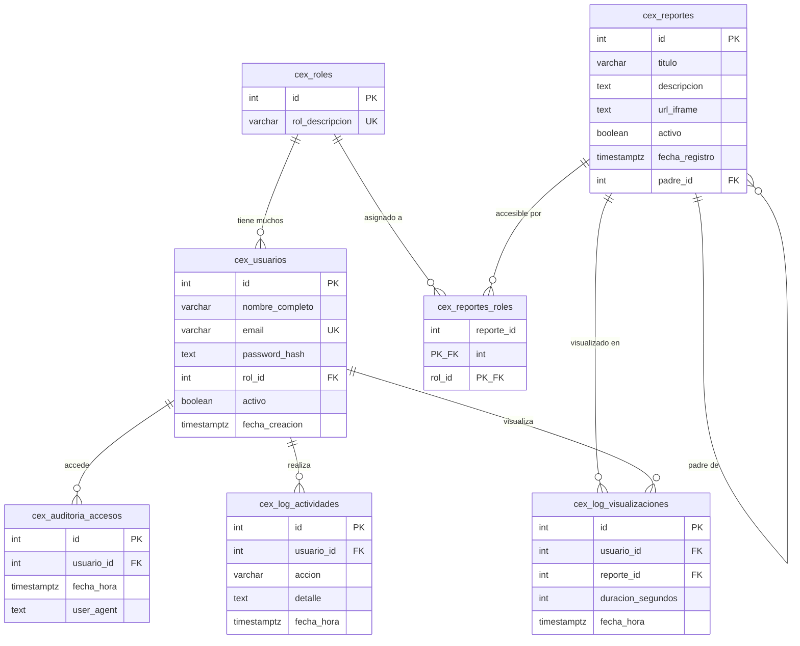

# Relaciones y Diagrama Entidad-Relacion

**Base de datos:** PostgreSQL  
**ORM:** Prisma 6.0  
**Esquema:** public

---

## Mapa Completo de Relaciones

### Relaciones Uno a Muchos (1:N)

| Tabla Padre | Tabla Hija | FK en Tabla Hija | Regla de Eliminacion | Descripcion |
|-------------|-----------|-----------------|---------------------|-------------|
| `cex_roles` | `cex_usuarios` | `rol_id` | Restringida (default) | Un rol tiene muchos usuarios |
| `cex_roles` | `cex_reportes_roles` | `rol_id` | `CASCADE` | Un rol se asigna a muchos reportes |
| `cex_reportes` | `cex_reportes_roles` | `reporte_id` | `CASCADE` | Un reporte se asigna a muchos roles |
| `cex_reportes` | `cex_reportes` | `padre_id` | `SET NULL` | Un reporte padre tiene muchos sub-reportes |
| `cex_reportes` | `cex_log_visualizaciones` | `reporte_id` | Restringida (default) | Un reporte tiene muchos registros de visualizacion |
| `cex_usuarios` | `cex_auditoria_accesos` | `usuario_id` | Restringida (default) | Un usuario tiene muchos registros de acceso |
| `cex_usuarios` | `cex_log_actividades` | `usuario_id` | Restringida (default) | Un usuario tiene muchos registros de actividad |
| `cex_usuarios` | `cex_log_visualizaciones` | `usuario_id` | Restringida (default) | Un usuario tiene muchos registros de visualizacion |

### Relaciones Muchos a Muchos (N:M)

| Tabla A | Tabla B | Tabla Intermedia | Descripcion |
|---------|---------|-----------------|-------------|
| `cex_roles` | `cex_reportes` | `cex_reportes_roles` | Asignacion de acceso: que roles pueden ver que reportes |

### Relacion Auto-referencial

| Tabla | Campo FK | Tipo | Regla de Eliminacion | Descripcion |
|-------|----------|------|---------------------|-------------|
| `cex_reportes` | `padre_id` | Muchos a Uno (N:1), nullable | `SET NULL` | Jerarquia de reportes padre-hijo. Si el padre se elimina, los hijos pasan a nivel raiz |

---

## Diagrama Entidad-Relacion (Mermaid)



---

## Diagrama de Flujo de Datos

```
                    cex_roles
                   /         \
                  /           \
          (1:N) /             \ (N:M via pivot)
               /               \
      cex_usuarios        cex_reportes_roles        cex_reportes
           |                                       /      |       \
           |                                      /       |        \
     +-----+-----+--------+            (auto-ref)/   (1:N)|    (1:N)\
     |     |     |        |                     /         |          \
  accesos logs  viz    (N:1)            cex_reportes   viz_logs   roles_pivot
```

---

## Notas sobre Soft Delete

El sistema utiliza **eliminacion logica (soft delete)** en dos tablas:

| Tabla | Campo | Comportamiento |
|-------|-------|----------------|
| `cex_usuarios` | `activo` (BOOLEAN, default: true) | Los usuarios inactivos (`activo = false`) no pueden iniciar sesion. El endpoint DELETE establece `activo = false` |
| `cex_reportes` | `activo` (BOOLEAN, default: true) | Los reportes inactivos no se muestran a usuarios regulares. El endpoint DELETE establece `activo = false` |

**Implicacion:** Los registros nunca se eliminan fisicamente de estas tablas. Las consultas del frontend filtran por `activo = true` (excepto en vistas de administracion donde se muestran ambos estados).

---

## Notas sobre Integridad Referencial

1. **Cascada en ReportRole:** La eliminacion de un reporte o rol elimina automaticamente las asignaciones en la tabla pivot.
2. **SetNull en jerarquia:** La eliminacion de un reporte padre establece `padre_id = null` en los hijos (los promueve a nivel raiz).
3. **Restriccion en logs:** Los registros de auditoria, actividad y visualizacion tienen restriccion por defecto. No se puede eliminar un usuario que tenga registros asociados sin antes eliminar esos registros.
4. **Sin eliminacion fisica:** Dado que se usa soft delete, las restricciones de integridad referencial en logs rara vez se activan en la practica.
